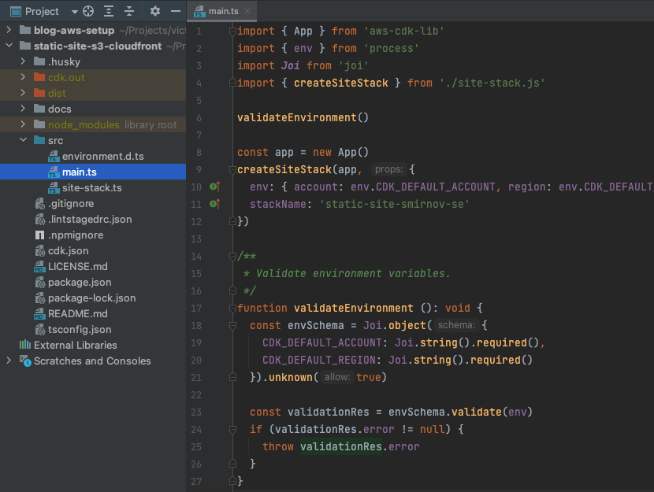
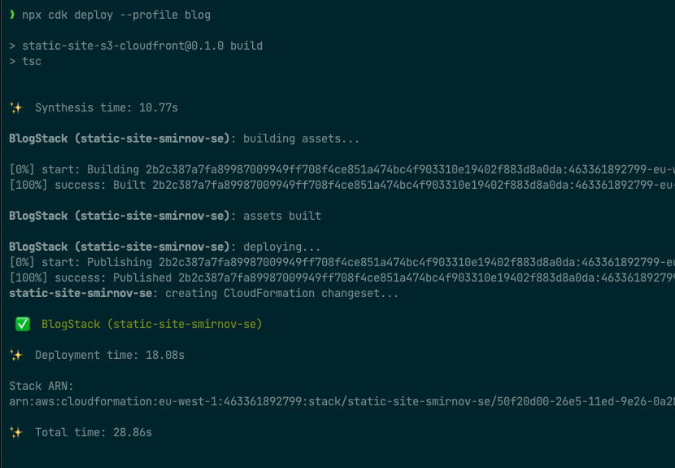
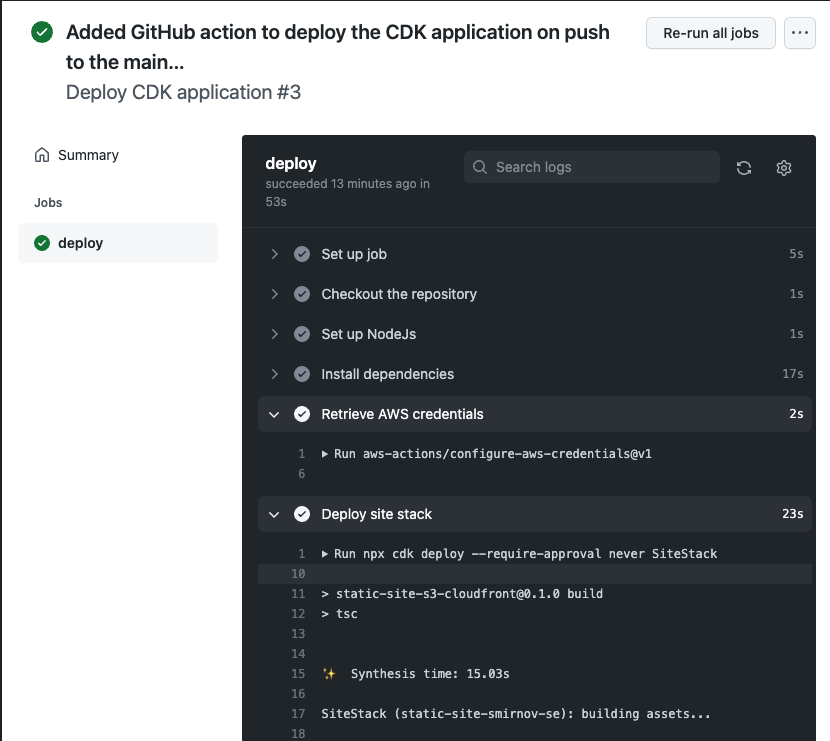

[](https://github.com/victorsmirnov/static-site-s3-cloudfront/blob/master/LICENSE.md)
[](https://github.com/standard/ts-standard)

# CDK script to deploy the static site to S3 and CloudFront

## Overview

The project is a companion to the [tutorial][1] on my blog.

We will implement infrastructure for the static website with the following features.

* Host website on [Amazon S3][2] private bucket.
* Use [Amazon CloudFront][3] CDN in front of the website to cache the site data and send security headers.
* Support both HTTPS and HTTP protocols with an automatic redirect from HTTP to HTTPS.
* Use [AWS CDK][4] to define and deploy the infrastructure.
* Automatically update the infrastructure and deploy the website with [GitHub actions][5].

We guide you through the development process. Every Git commit adds a slight change to the application,
and we use tags to show milestones.

## Prerequisites

We deploy the website in the Amazon AWS public cloud. If you want to follow the tutorial,
you might want to create an AWS account. The [getting started guide][6] or the [CDK Workshop prerequisites][7]
section contains everything you need to know.

Please find below a checklist with prerequisites to perform the tutorial.
- [ ] Create an IAM user for the AWS account.
- [ ] Set up AWS CLI and register the user's credentials with it.
- [ ] Install NodeJs on your computer. I recommend the latest stable version (LTS), which is now 16.17.0.
- [ ] Register DNS zone for website's domain in the [AWS Route 53][8].

## Initial CDK application

In the first noteworthy commit, we create a minimalistic CDK application. And it looks something like this.



* `.husky` contains a GitHook definition to check code formatting on commit.
* `cdk.out` is the folder where the CDK application keeps its generated code.
* `dist` is the out directory for the TypeScript compiler, and the CDK application takes scripts from there.
* `src/main.ts` is the entry point for the CDK application. Please keep in mind that we compile
  the TypeScript code first. Then we run the JavaScript code from the `dist` folder.
* `src/site-stack.ts` holds our stack definition.
* `cdk.json` tells the toolkit how to run the application. In our case, it instructs the toolkit to compile
  the application and run the JavaScript code.

At the moment, we should be able to deploy our application.



* `npm run build` compile TypeScript from the `src` folder to JavaScript in the `dist` folder.
* `npx cdk diff` compare deployed stack with the current state.
* `npx cdk deploy` deploy this stack to the default AWS account and region from the default profile.
* `npm run clean` removes all compiled JavaScript code and generated CDK templates.
* `npm run format` fixes source code formatting and checks the code for the coding standard.
* `npm run test` does not do any test but only validates code formatting.

## Retrieving AWS credentials in GitHub actions

We need AWS credentials to run the CDK deployment in GitHub actions. But we do not want to keep the API credentials
in the repository secrets because this would require updating the credentials manually. So instead, the best approach
would be to set up IAM permissions, allowing actions in the repository to deploy. Then, we decide which GitHub project
can do what by changing the IAM roles.

Luckily, we can configure the OpenID connection in our AWS account for GitHub. So GitHub can obtain temporary AWS
credentials by using this connection. And we can decide what role the action can assume. Please check
[the manual][9] for a detailed explanation.

We should add the GitHub OIDC provider only once to the AWS account and link different roles to it.
To achieve this, I extracted the construct for the OpenID connection provider to the dedicated stack.
Then, we deploy it with the following command.

```shell
npx cdk deploy GithubConnectionStack
```

We should create a role for the GitHub actions by manually deploying the site stack.

```shell
npx cdk deploy SiteStack
```

Next time we push to the main branch, the GitHub action assumes the role to run the deployment.

## Automatic CDK deployment from the GitHub actions

The deployment feels like bliss when we have the AWS credentials in place. Please check the code of the action below.

```yaml
      - name: Retrieve AWS credentials
        uses: aws-actions/configure-aws-credentials@v1
        with:
          role-to-assume: ${{ secrets.AWS_ROLE_ARN }}
          aws-region: ${{ secrets.AWS_REGION }}

      - name: Deploy site stack
        run: npx cdk deploy --require-approval never SiteStack

```

We [retrieve temporary AWS credentials][10] for the given role. And then, we run the CDK deployment as we do on
the local computer.



We now have an empty CDK project with CI we can use as a starting point in the future.
Let's add static site resources to it.


[1]: https://victorsmirnov.blog/static-s3-site-cloudfront/
[2]: https://aws.amazon.com/s3/
[3]: https://aws.amazon.com/cloudfront/
[4]: https://aws.amazon.com/cdk/
[5]: https://github.com/features/actions
[6]: https://aws.amazon.com/getting-started/guides/setup-environment/
[7]: https://cdkworkshop.com/15-prerequisites.html
[8]: https://aws.amazon.com/route53/
[9]: https://docs.github.com/en/actions/deployment/security-hardening-your-deployments/configuring-openid-connect-in-amazon-web-services
[10]: https://github.com/aws-actions/configure-aws-credentials
